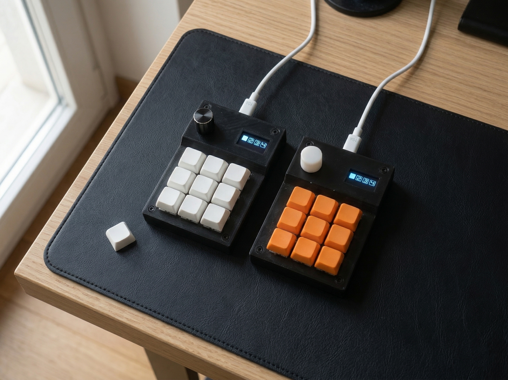

  

  <h1>MACROLAB 3x3 Custom Macropad</h1>
  
  
<strong>Total Control. Handcrafted. Powered by RP2040 & Vial.</strong>

  
  
  
  
  

 

## 🚀 About The Project

MACROLAB is a custom 3x3 macropad designed from scratch for creators, developers, and power users. It acts as a hardware extension of your workflow, replacing clunky software interfaces with tactile, physical controls.

Unlike commercial alternatives, MACROLAB requires **zero background software or drivers**. It runs entirely on the open-source QMK/Vial firmware and stores all your macros directly on the device's internal memory.

### ✨ Key Features
* **RP2040 Brain:** Dual-core power for zero-latency execution.
* **100% Web Configurable:** Remap keys instantly via [vial.rocks](https://vial.rocks).
* **Dynamic OLED Display:** Real-time layer indication with smart auto-sleep to prevent burn-in.
* **Infinite Rotary Encoder:** Aluminum dial (with push-button) perfect for timeline scrubbing or volume control.
* **Handcrafted Quality:** Custom 3D-printed enclosure paired with tactile mechanical switches.

---

## 🎯 Use Cases

Whether you are editing your next video or streaming live, the MACROLAB adapts to your needs:

1. **Video/Photo Editing:** Use the encoder for surgical timeline scrubbing in Premiere Pro/DaVinci, and map keys for quick tool selection.
2. **Streaming (OBS/Voicemod):** Map the keys to `F13-F24` to create a dedicated soundboard or scene switcher that never interferes with your typing.
3. **Productivity & Code:** Launch scripts, format code, or manage window tiling with single keypresses.

---

## 📂 Repository Structure

In this repository you will find all the hardware and firmware files related to the MACROLAB project:

* 📁 `Firmware/` - Contains the pre-compiled `.uf2` file for easy drag-and-drop flashing.
* 📁 `Hardware/3D_Models/` - STL files for the custom enclosure.
* 📁 `Hardware/PCB/` - Gerber files for manufacturing.

---

## 🛠️ Quick Start Guide

1. **Plug & Play:** Connect the macropad to your PC/Mac using a data-enabled USB-C cable.
2. **Configure:** Open a Chromium-based browser and navigate to [vial.rocks](https://vial.rocks).
3. **Connect:** Click "Start Vial", select the macropad from the prompt, and start assigning your keys and macros visually!

*Need a hard reset? Unplug the device, hold the top-left key, and plug it back in to mount the `RPI-RP2` drive and drop the `.uf2` firmware file.*

---

## 💎 Get Your Own & Discover More

To see the full gallery, read the extended manual, or check the interactive map of where MACROLABs have been shipped, visit the official website:

**🌐 [macrolab.netlify.app](https://macrolab.netlify.app)**

Don't want to source parts, solder, and build it yourself? I periodically build small batches of the MACROLAB. You can purchase a fully assembled, tested, and ready-to-use unit from my Tindie store:

**[🛒 Buy MACROLAB on Tindie](https://www.tindie.com/products/electronic_prints/3x3-custom-pcb-rp2040-macropad-oled-encoder/)**

---

## 🙏 Acknowledgements

A huge thank you to **[PCBWay](https://www.pcbway.com/)** for sponsoring the PCBs for the latest batch. Their fast turnaround and high-quality manufacturing made scaling this project possible.
